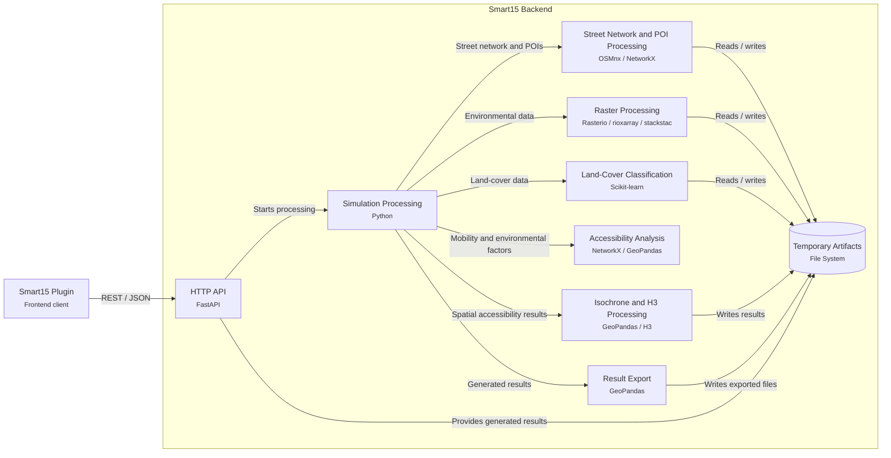

# Smart15 Backend — Component Diagram

This diagram presents the main logical components of the Smart15 backend and their responsibilities in the geospatial accessibility analysis workflow.

```mermaid
flowchart LR

    Plugin["Smart15 Plugin<br/><small>Frontend client</small>"]

    subgraph Backend["Smart15 Backend"]

        API["HTTP API<br/><small>FastAPI</small>"]

        Simulation["Simulation Processing<br/><small>Python</small>"]

        OSM["Street Network and POI Processing<br/><small>OSMnx / NetworkX</small>"]

        Raster["Raster Processing<br/><small>Rasterio / rioxarray / stackstac</small>"]

        Classification["Land-Cover Classification<br/><small>Scikit-learn</small>"]

        Accessibility["Accessibility Analysis<br/><small>NetworkX / GeoPandas</small>"]

        Spatial["Isochrone and H3 Processing<br/><small>GeoPandas / H3</small>"]

        Export["Result Export<br/><small>GeoPandas</small>"]

        Files[("Temporary Artifacts<br/><small>File System</small>")]
    end

    Plugin -->|"REST / JSON"| API

    API -->|"Starts processing"| Simulation

    Simulation -->|"Street network and POIs"| OSM
    Simulation -->|"Environmental data"| Raster
    Simulation -->|"Land-cover data"| Classification
    Simulation -->|"Mobility and environmental factors"| Accessibility
    Simulation -->|"Spatial accessibility results"| Spatial
    Simulation -->|"Generated results"| Export

    OSM -->|"Reads / writes"| Files
    Raster -->|"Reads / writes"| Files
    Classification -->|"Reads / writes"| Files
    Spatial -->|"Writes results"| Files
    Export -->|"Writes exported files"| Files

    API -->|"Provides generated results"| Files
```
