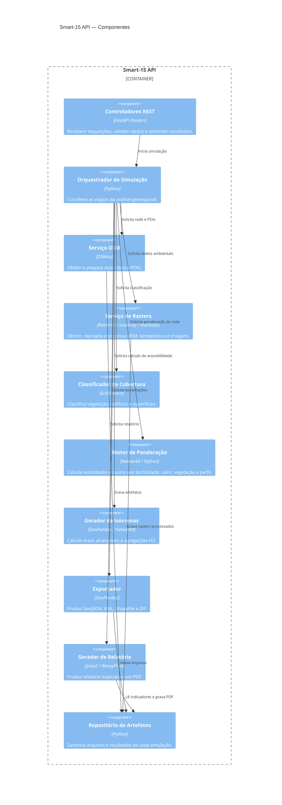

```mermaid
C4Component
    title Smart-15 API — Componentes

    Container_Boundary(api, "Smart-15 API") {

        Component(controller, "Controladores REST", "FastAPI Routers", "Recebem requisições, validam dados e retornam resultados.")

        Component(orchestrator, "Orquestrador de Simulação", "Python", "Coordena as etapas da análise geoespacial.")

        Component(osmService, "Serviço OSM", "OSMnx", "Obtém e prepara rede viária e POIs.")

        Component(rasterService, "Serviço de Rasters", "Rasterio / rioxarray / stackstac", "Obtém, reprojeta e processa DEM, temperatura e imagens.")

        Component(classifier, "Classificador de Cobertura", "Scikit-learn", "Classifica vegetação, edifícios e superfícies.")

        Component(weighting, "Motor de Ponderação", "NetworkX / Python", "Calcula velocidades e custos por declividade, calor, vegetação e perfil.")

        Component(isochrones, "Gerador de Isócronas", "GeoPandas / NetworkX", "Calcula áreas alcançáveis e agregações H3.")

        Component(exporter, "Exportador", "GeoPandas", "Produz GeoJSON, KML, Shapefile e ZIP.")

        Component(report, "Gerador de Relatório", "Jinja2 / WeasyPrint", "Produz relatório explicativo em PDF.")

        Component(repository, "Repositório de Artefatos", "Python", "Gerencia arquivos e resultados de cada simulação.")
    }

    Rel(controller, orchestrator, "Inicia simulação")
    Rel(orchestrator, osmService, "Solicita rede e POIs")
    Rel(orchestrator, rasterService, "Solicita dados ambientais")
    Rel(orchestrator, classifier, "Solicita classificação")
    Rel(orchestrator, weighting, "Solicita ponderação da rede")
    Rel(orchestrator, isochrones, "Solicita cálculo de acessibilidade")
    Rel(orchestrator, exporter, "Solicita exportações")
    Rel(orchestrator, report, "Solicita relatório")
    Rel(osmService, repository, "Grava artefatos")
    Rel(rasterService, repository, "Grava rasters processados")
    Rel(exporter, repository, "Grava arquivos")
    Rel(report, repository, "Lê indicadores e grava PDF")
```
