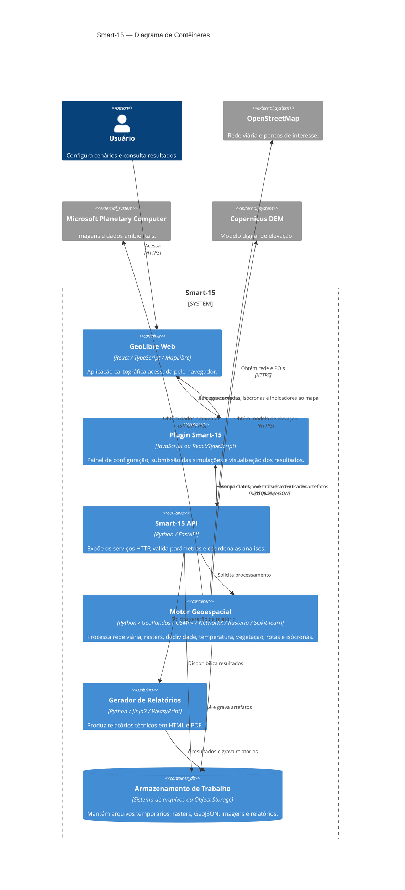

```mermaid
C4Container
    title Smart-15 — Diagrama de Contêineres

    Person(usuario, "Usuário", "Configura cenários e consulta resultados.")

    System_Ext(osm, "OpenStreetMap", "Rede viária e pontos de interesse.")
    System_Ext(planetary, "Microsoft Planetary Computer", "Imagens e dados ambientais.")
    System_Ext(copernicus, "Copernicus DEM", "Modelo digital de elevação.")

    System_Boundary(smart15, "Smart-15") {

        Container(web, "GeoLibre Web", "React / TypeScript / MapLibre", "Aplicação cartográfica acessada pelo navegador.")

        Container(plugin, "Plugin Smart-15", "JavaScript ou React/TypeScript", "Painel de configuração, submissão das simulações e visualização dos resultados.")

        Container(api, "Smart-15 API", "Python / FastAPI", "Expõe os serviços HTTP, valida parâmetros e coordena as análises.")

        Container(engine, "Motor Geoespacial", "Python / GeoPandas / OSMnx / NetworkX / Rasterio / Scikit-learn", "Processa rede viária, rasters, declividade, temperatura, vegetação, rotas e isócronas.")

        Container(report, "Gerador de Relatórios", "Python / Jinja2 / WeasyPrint", "Produz relatórios técnicos em HTML e PDF.")

        ContainerDb(storage, "Armazenamento de Trabalho", "Sistema de arquivos ou Object Storage", "Mantém arquivos temporários, rasters, GeoJSON, imagens e relatórios.")
    }

    Rel(usuario, web, "Acessa", "HTTPS")
    Rel(web, plugin, "Carrega e executa")
    Rel(plugin, api, "Envia parâmetros e consulta resultados", "REST/JSON")
    Rel(api, engine, "Solicita processamento")
    Rel(api, report, "Solicita geração de relatório")
    Rel(engine, osm, "Obtém rede e POIs", "HTTPS")
    Rel(engine, planetary, "Obtém dados ambientais", "STAC/HTTPS")
    Rel(engine, copernicus, "Obtém modelo de elevação", "HTTPS")
    Rel(engine, storage, "Lê e grava artefatos")
    Rel(report, storage, "Lê resultados e grava relatórios")
    Rel(api, storage, "Disponibiliza resultados")
    Rel(api, plugin, "Retorna status, indicadores e URLs dos artefatos", "JSON/GeoJSON")
    Rel(plugin, web, "Adiciona camadas, isócronas e indicadores ao mapa")
```
