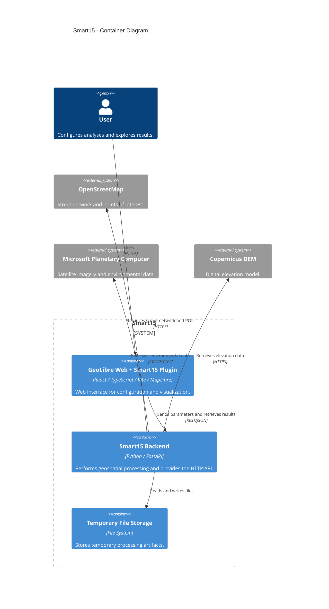

# Smart15 — Container Diagram

This diagram presents the main runtime components of Smart15 and their interactions with external geospatial data sources.

```mermaid
C4Container
    title Smart15 - Container Diagram

    Person(user, "User", "Configures analyses and explores results.")

    System_Ext(osm, "OpenStreetMap", "Street network and points of interest.")
    System_Ext(planetary, "Microsoft Planetary Computer", "Satellite imagery and environmental data.")
    System_Ext(copernicus, "Copernicus DEM", "Digital elevation model.")

    System_Boundary(smart15, "Smart15") {
        Container(web, "GeoLibre Web + Smart15 Plugin", "React / TypeScript / Vite / MapLibre", "Web interface for configuration and visualization.")
        Container(backend, "Smart15 Backend", "Python / FastAPI", "Performs geospatial processing and provides the HTTP API.")
        Container(storage, "Temporary File Storage", "File System", "Stores temporary processing artifacts.")
    }

    Rel(user, web, "Uses", "HTTPS")
    Rel(web, backend, "Sends parameters and retrieves results", "REST/JSON")
    Rel(backend, osm, "Retrieves street network and POIs", "HTTPS")
    Rel(backend, planetary, "Retrieves environmental data", "STAC/HTTPS")
    Rel(backend, copernicus, "Retrieves elevation data", "HTTPS")
    Rel(backend, storage, "Reads and writes files")
```
