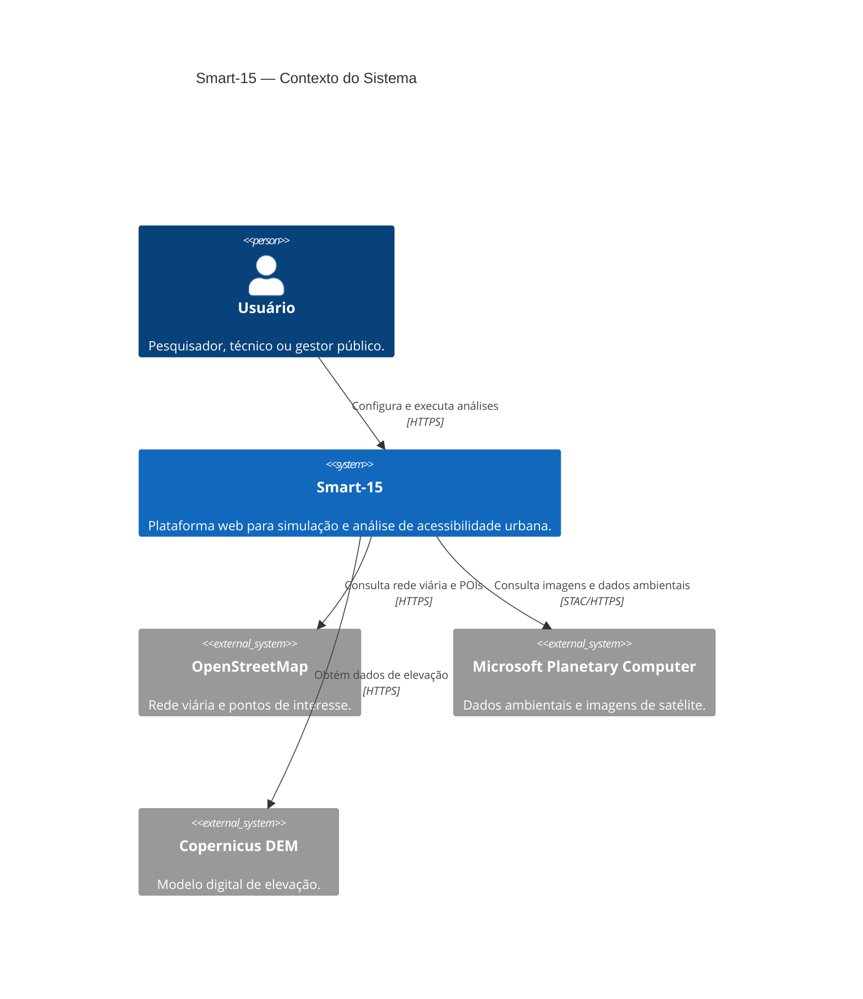

```mermaid
C4Context
    title Smart-15 — Contexto do Sistema

    Person(usuario, "Usuário", "Pesquisador, técnico ou gestor público.")

    System(smart15, "Smart-15", "Plataforma web para simulação e análise de acessibilidade urbana.")

    System_Ext(osm, "OpenStreetMap", "Rede viária e pontos de interesse.")
    System_Ext(planetary, "Microsoft Planetary Computer", "Dados ambientais e imagens de satélite.")
    System_Ext(copernicus, "Copernicus DEM", "Modelo digital de elevação.")

    Rel(usuario, smart15, "Configura e executa análises", "HTTPS")
    Rel(smart15, osm, "Consulta rede viária e POIs", "HTTPS")
    Rel(smart15, planetary, "Consulta imagens e dados ambientais", "STAC/HTTPS")
    Rel(smart15, copernicus, "Obtém dados de elevação", "HTTPS")
    
```
