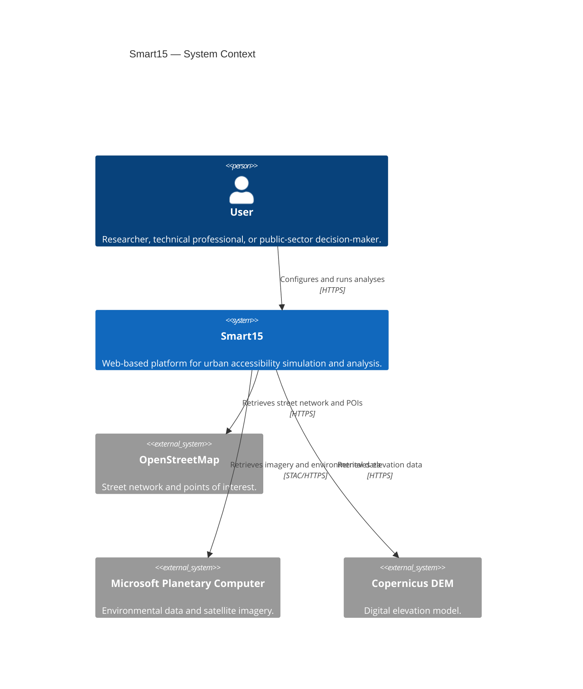

```mermaid
C4Context
    title Smart15 — System Context

    Person(user, "User", "Researcher, technical professional, or public-sector decision-maker.")

    System(smart15, "Smart15", "Web-based platform for urban accessibility simulation and analysis.")

    System_Ext(osm, "OpenStreetMap", "Street network and points of interest.")
    System_Ext(planetary, "Microsoft Planetary Computer", "Environmental data and satellite imagery.")
    System_Ext(copernicus, "Copernicus DEM", "Digital elevation model.")

    Rel(user, smart15, "Configures and runs analyses", "HTTPS")
    Rel(smart15, osm, "Retrieves street network and POIs", "HTTPS")
    Rel(smart15, planetary, "Retrieves imagery and environmental data", "STAC/HTTPS")
    Rel(smart15, copernicus, "Retrieves elevation data", "HTTPS")
    
```
